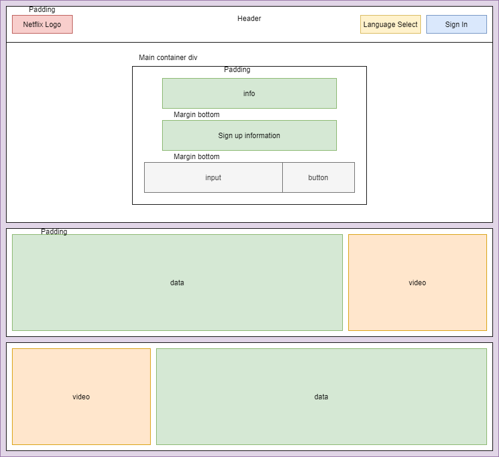

<h1>Netflix Login</h1>
<blockquote>Welcome, 
 
This is a visual clone of Netflix Login page which is built using vanilla html, css and javascript.
 
Author: Nikhil Nalande
</blockquote>

<a href="https://nalandenv.github.io/netflix-login-replica/">Click Here</a> to Visit Live version
 
<h3><strong>User Requirements:</strong></h3>
<li>Home page where you can sign up.</li>
<li>Site must be responsive and usable on all kinds of devices.</li>
<li>Site needs to support older browsers.</li>
<li>Needs a link to visit login page.</li>
<li>Login Page must contain email/phone option to login with password.</li>
<li>Login Page must also contain option to log in with Facebook.</li>
<li>Login Page must have links to all relevant information for the user to see.</li>
<li>Both pages should have option to change language.</li>
<h3><b>Diagrams:</b></h3>

Login Page-

Home Page-

 
<h2><b>Overview</b></h2>

Now you visit the page you'll be greeted with a login page as shown in screenshot below.

      If you visit the site on a mobile device then the page will be as follows
    

    

